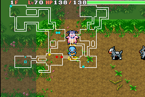

# Dungeon Generator 2025

This image seems like a reasonable example what what we are going for.

## Hallway Generation
1. Select point on edge of two rooms
2. From the first point, go directly out from the wall

- Hallways never connect to the same side for both rooms, ie. right side of room 1 never connects to right side of room 2. Might just want to connect to either of the two closest sides even.
- Have a chance that a second entrance to a hallway will be created, this should connect within the first 3 straights of the hallway.
- Have a chance that an additional hallway that doesn't lead to a room gets created, this should have a limited number of straight available.
- Have a chance that a hallway will have an additional straight that will connect it to a seperate hallway.

